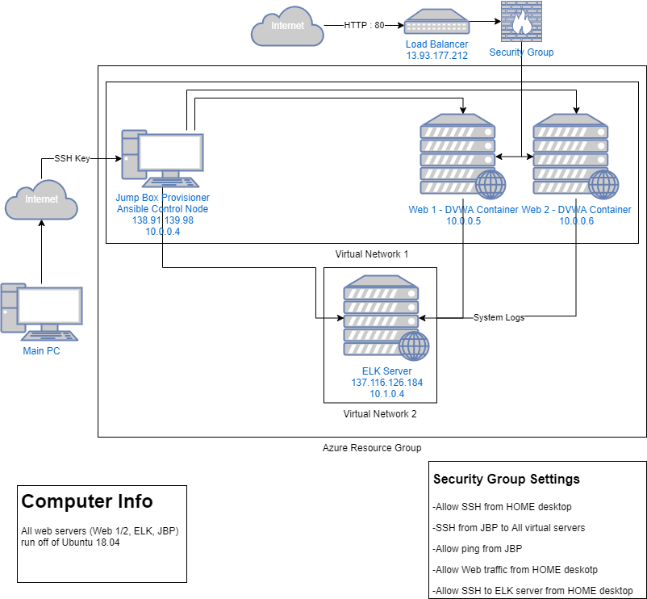

## Automated ELK Stack Deployment

The files in this repository were used to configure the network depicted below.

These files have been tested and used to generate a live ELK deployment on Azure. They can be used to either recreate the entire deployment pictured above. Alternatively, select portions of the `filebeat-playbook` or `metricbeat-playbook` file may be used to install only certain pieces of it, such as Filebeat.

Playbook and Config Files
- pentest.yml
  - Used to install docker, python, pip, all used to create and launch the DVWA container
- install-elk.yml
  - Used to install necessary modules in order to create and use the Elk container
- filebeat-playbook.yml
  - Used to target the Web VM's to install filebeat for Kibana monitoring
- filebeat-config.yml
  - Used to configure the above script
- metricbeat-playbook.yml
  - Used to target the Web VM's to install metricbeat for Kibana monitoring
- metricbeat-config.yml
  - Used to configure the above script

This document contains the following details:
- Description of the Topology
- Access Policies
- ELK Configuration
  - Beats in Use
  - Machines Being Monitored
- How to Use the Ansible Build

### Description of the Topology

The main purpose of this network is to expose a load-balanced and monitored instance of DVWA, the D*mn Vulnerable Web Application.

Load balancing ensures that the application will be highly available, in addition to restricting access to the network.

Integrating an ELK server allows users to easily monitor the vulnerable VMs for changes to the logs and system services.

The configuration details of each machine may be found below.

| Name     | Function | IP Address | Operating System |
|----------|----------|------------|------------------|
| Jump Box | Gateway  | 10.0.0.4   | Linux            |
| Web-1     | Web Server | 10.0.0.5 | Linux |
| Web-2     | Web Server | 10.0.0.6 | Linux |
| ELK-VM     | VM Monitoring | 10.1.0.4 | Linux |

### Access Policies

The machines on the internal network are not exposed to the public Internet. 

Only the Jump Box machine can accept connections from the Internet. Access to this machine is only allowed from the following IP addresses:
- 70.113.47.61

Machines within the network can only be accessed by 10.0.0.4.

A summary of the access policies in place can be found in the table below.

| Name     | Publicly Accessible | Allowed IP Addresses |
|----------|---------------------|----------------------|
| Jump Box | No | 70.113.47.61 |
| Web-1| Yes | Any |
| Web-2| Yes | Any|
| ELK | No | 70.113.47.61 |

### Elk Configuration

Ansible was used to automate configuration of the ELK machine. No configuration was performed manually, which is advantageous because pre-built scripts make deployment simple and effecient.

The playbook implements the following tasks:
- Install docker
- Install pip3 and python
- Extend allowed memory
- Download and configure ELK docker container with ports (5601, 9200, 5044) open
- Force docker container to auto-start on system start

The following screenshot displays the result of running `docker ps` after successfully configuring the ELK instance.

### Target Machines & Beats
This ELK server is configured to monitor the following machines:
- 10.0.0.5
- 10.0.0.6

We have installed the following Beats on these machines:
- 10.0.0.5
- 10.0.0.6

These Beats allow us to collect the following information from each machine:
- Filebeats: Collects log events
- Metricbeats: Operating system metrics and system services information

### Using the Playbook
In order to use the playbook, you will need to have an Ansible control node already configured. Assuming you have such a control node provisioned: 

SSH into the control node and follow the steps below:
- Copy the `install-elk.yml` file to `/etc/ansible` on the Jump Box provisioner.
- Update the `install-elk.yml` file to include your specific remote_user login and host name from the `ansible.cfg`
- Run the playbook, and navigate to `http://[elk public IP]:5601` to check that the installation worked as expected.